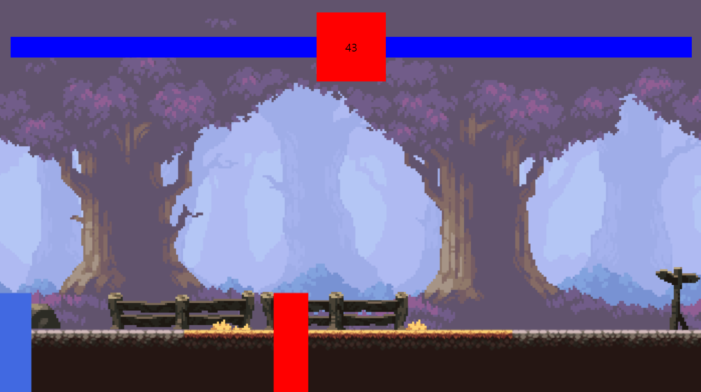
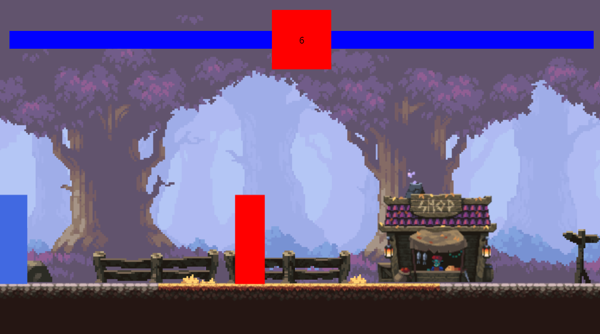
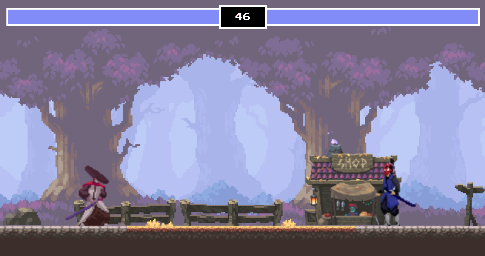

## 자바스크립트 전투 게임

### 2023-05-25

- 배경이미지 추가
- `player1` 과 `player2`의 공격 기능, 체력기능 추가

- 현재까지 구현된 프로젝트

### 2023-05-26

- Animation Sprite `상점`추가
- `players` 배경의 땅에서 움직이도록 위치 조정
- 현재까지 구현된 프로젝트

### 2023-05-30

- `enemy` Sprite 추가
- `공격` `점프` `떨어짐` Sprite Animation 추가

### 2023-05-31 / 프로젝트 완성

- `공격에 대한 반응` `캐릭터 죽음` Sprite Animation 추가
- `폰트` `Health bar` 색상 변경
- 프로젝트 완성

### 배운점

- `코드 리팩토링`: `클래스`,`상속`을 이용하지 않았다면 코드가 복잡하고 기능 확장에도 어려움이 있었을 것이다.
- `How to Code` : 평소에 확장성과 가독성을 고려하지 않고 코드 작성을 하였는데 본 프로젝트를 통해 코드로 무작정 옮기기 보다는 생각을 하고 코드 구성을 하는 것이 중요하다는 것을 알게 되었다.

### 추가구현

### 2023-06-25

- `lecture`에는 없는 `캐릭터 flip`기능 추가
- `캐릭터 flip`시에 발생하는 `공격 방향 변경` 문제 해결
